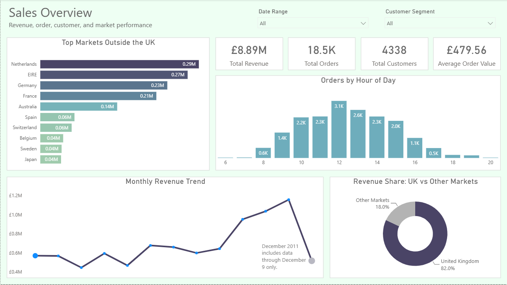
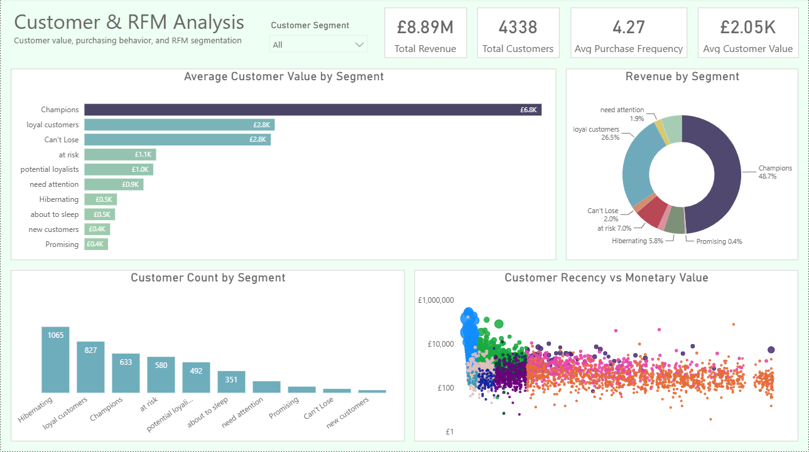
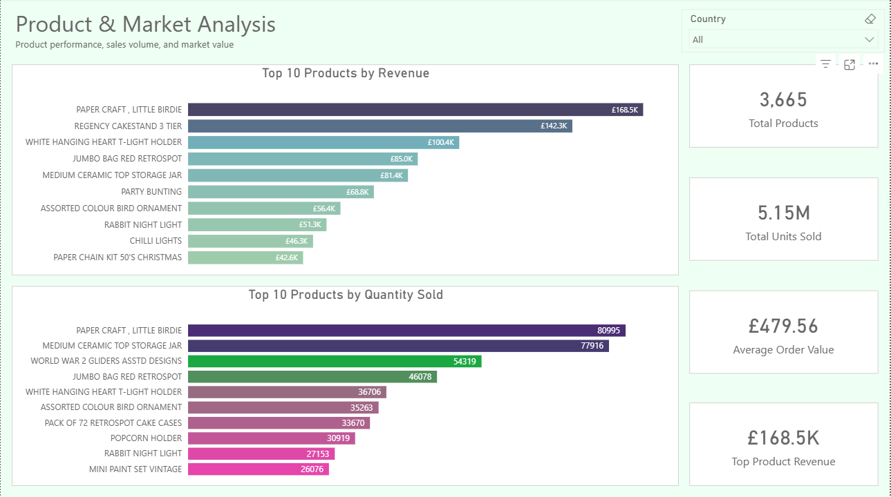

# Online Retail Customer Analysis and Power BI Dashboard

## Project Overview

This project presents an end-to-end analysis of transactional data from a UK-based online retailer. The workflow includes data cleaning, exploratory analysis, RFM customer segmentation, and the development of a three-page interactive Power BI dashboard.

Python was used to prepare and analyze the data, while Power BI was used to organize the findings into a clear reporting experience focused on sales performance, customer value, purchasing behavior, product demand, and market contribution.

---

## Project Objectives

The project was developed to:

- Clean and prepare raw transactional data for analysis
- Examine revenue, order, customer, product, and market performance
- Identify sales patterns across time, countries, and transaction hours
- Segment customers using Recency, Frequency, and Monetary value
- Compare customer segments by size and revenue contribution
- Identify the products generating the highest revenue and sales volume
- Build an interactive Power BI dashboard for presenting the results

---

## Dataset

The dataset was obtained from Kaggle and contains transactions recorded by a UK-based online retailer between **December 1, 2010** and **December 9, 2011**.

The original dataset contained **541,909 transaction rows**. After removing incomplete customer records, invalid transactions, non-positive quantities and prices, and duplicate rows, the final cleaned dataset contained **392,692 valid transaction rows**.

### Main Fields

| Field | Description |
|---|---|
| `InvoiceNo` | Unique invoice identifier |
| `StockCode` | Product identifier |
| `Description` | Product description |
| `Quantity` | Number of units purchased |
| `InvoiceDate` | Date and time of the transaction |
| `UnitPrice` | Price per unit in GBP |
| `CustomerID` | Unique customer identifier |
| `Country` | Customer country |
| `TotalPrice` | Transaction value calculated as quantity multiplied by unit price |

---

## Data Preparation

The data preparation process included:

- Removing rows with missing `CustomerID` values
- Converting `InvoiceDate` to a valid date and time format
- Removing transactions with zero or negative quantities
- Removing records with zero or negative unit prices
- Checking and removing duplicate rows
- Converting customer identifiers to the appropriate data type
- Creating the `TotalPrice` field
- Preparing a customer-level RFM dataset
- Separating product records from non-product entries such as postage, manual adjustments, fees, and samples

The cleaned transaction-level dataset was used for sales, market, and product analysis. A separate customer-level table was used for RFM analysis.

---

## Exploratory Analysis

The exploratory analysis covered:

- Monthly revenue trends
- Revenue contribution by country
- Market performance outside the United Kingdom
- Order activity by hour of day
- Highest-revenue products
- Highest-volume products
- Customer purchasing frequency
- Customer spending behavior
- Revenue concentration across customer segments

---

## RFM Customer Segmentation

RFM analysis was used to classify customers according to three dimensions:

- **Recency:** Number of days since the customer's most recent purchase
- **Frequency:** Number of unique purchases made by the customer
- **Monetary:** Total amount spent by the customer

Customers were assigned RFM scores and grouped into the following behavioral segments:

- Champions
- Loyal Customers
- Potential Loyalists
- New Customers
- Promising
- Need Attention
- About to Sleep
- At Risk
- Can't Lose Them
- Hibernating

The segmentation helps distinguish high-value and loyal customers from customers who may require retention or reactivation strategies.

---

## Power BI Dashboard

The final Power BI report contains three analytical pages.

### 1. Sales Overview

This page summarizes overall business performance and includes:

- Total revenue
- Total orders
- Total customers
- Average order value
- Monthly revenue trend
- Revenue share of the United Kingdom versus other markets
- Top international markets by revenue
- Order activity by hour of day
- Date range and customer segment filters



### 2. Customer and RFM Analysis

This page focuses on customer value and purchasing behavior and includes:

- Total revenue
- Total customers
- Average purchase frequency
- Average customer value
- Customer count by segment
- Revenue contribution by segment
- Average customer value by segment
- Customer recency versus monetary value
- Interactive customer segment filtering

The monetary axis in the customer scatter plot uses a logarithmic scale to improve readability across a wide range of customer values.



### 3. Product and Market Analysis

This page compares product performance using revenue and sales volume and includes:

- Total products
- Total units sold
- Average order value
- Revenue generated by the highest-performing product
- Top 10 products by revenue
- Top 10 products by quantity sold
- Interactive country filtering



---

## Key Results

| Metric | Result |
|---|---:|
| Total Revenue | **£8.89M** |
| Total Customers | **4,338** |
| Total Orders | **18,532** |
| Total Products | **3,665** |
| Total Units Sold | **5.15M** |
| Average Order Value | **£479.56** |
| Average Purchase Frequency | **4.27** |
| Average Customer Value | **£2.05K** |
| Top Product Revenue | **£168.5K** |

---

## Key Findings

- The United Kingdom generated approximately **82% of total revenue**, showing a strong dependence on the domestic market.
- The Netherlands, Ireland (listed as `EIRE` in the source data), Germany, France, and Australia were among the strongest markets outside the United Kingdom.
- Monthly revenue increased substantially during the later months of 2011 and reached its highest level in November.
- December 2011 contains data only through December 9 and should not be interpreted as a complete month.
- Order activity was concentrated mainly during standard daytime business hours.
- Champions generated approximately **48.7% of total revenue**.
- Loyal Customers contributed approximately **26.5% of revenue**.
- Champions and Loyal Customers together generated more than **75% of total revenue**.
- Hibernating was the largest customer segment by population, with **1,065 customers**, but contributed a relatively small share of total revenue.
- The At Risk segment represented an important retention opportunity because it included a substantial number of customers and approximately **7% of revenue**.
- `PAPER CRAFT, LITTLE BIRDIE` was the highest-performing product by both revenue and quantity sold.
- The leading products by revenue were not identical to the leading products by quantity, showing that product price and sales volume affected rankings differently.

---

## Business Interpretation

The findings suggest several practical actions:

- Protect relationships with Champions through personalized communication, recognition, and exclusive offers.
- Strengthen loyalty programs for repeat and high-value customers.
- Prioritize At Risk and Can't Lose Them customers for targeted retention campaigns.
- Encourage Potential Loyalists to make repeat purchases through timely offers and product recommendations.
- Develop separate reactivation strategies for Hibernating customers.
- Reduce dependence on the United Kingdom by examining opportunities in established international markets.
- Maintain product availability for high-revenue and high-volume products.
- Evaluate high-volume products separately from high-revenue products when making pricing, inventory, and promotion decisions.

---

## Data Model

The Power BI model uses two primary tables.

### `cleaned_online_retail`

Transaction-level data used for:

- Sales analysis
- Order analysis
- Product analysis
- Country and market analysis
- Time-based analysis

### `final_rfm_segments`

Customer-level data used for:

- RFM scoring
- Customer segmentation
- Customer value analysis
- Segment-level reporting

The tables are connected through `CustomerID` using a one-to-many relationship:

```text
final_rfm_segments[CustomerID]  1  ─────  *  cleaned_online_retail[CustomerID]
```

A calendar table is also used for time-based reporting.

---

## Tools and Technologies

- Python
- Pandas
- NumPy
- Matplotlib
- Seaborn
- JupyterLab
- Power BI
- Power Query
- DAX

---

## Repository Structure

```text
online-retail-analysis/
│
├── README.md
│
├── data/
│   ├── README.md
│   └── final_rfm_segments.csv
│
├── notebooks/
│   ├── Cleaning.ipynb
│   ├── exploration.ipynb
│   └── Analysis.ipynb
│
├── dashboard/
│   └── online_retail_analysis.pbix
│
└── images/
    ├── sales_overview.png
    ├── customer_rfm_analysis.png
    └── product_market_analysis.png
```

The raw and cleaned transaction files are not required to be stored in the repository. The cleaned transaction dataset is approximately 37 MB and may exceed the browser-based GitHub upload limit. A short `data/README.md` file can be used to document the Kaggle source, expected filenames, and instructions for regenerating the cleaned data from the notebooks.

---

## How to Use the Project

1. Clone or download the repository.
2. Download the original Online Retail dataset from Kaggle and place it in the local `data` folder using the filename expected by the cleaning notebook.
3. Run the notebooks in the following order:
   - `Cleaning.ipynb`
   - `exploration.ipynb`
   - `Analysis.ipynb`
4. Confirm that the cleaned transaction dataset and RFM segmentation output have been created.
5. Open the Power BI file in Power BI Desktop.
6. Refresh the data sources if the local file paths have changed.
7. Use the report filters to explore performance by date, country, and customer segment.

---

## Limitations

- Transactions without customer identifiers were excluded from customer-level analysis.
- Cancelled, returned, zero-quantity, and non-positive-price transactions were removed.
- The dataset covers a limited period and does not represent multiple complete business years.
- December 2011 contains only partial-month data.
- RFM segments were created using heuristic score-based rules and may be adjusted for different business objectives.
- The RFM output represents customer behavior across the full analysis period and is not recalculated dynamically when a report date filter changes.
- Product rankings reflect the cleaned dataset and the filtering rules used to remove non-product records.

---

## Conclusion

This project demonstrates a complete data analysis workflow, beginning with raw transactional data and ending with an interactive business intelligence report.

The analysis shows that revenue was concentrated both geographically and across customer segments. The United Kingdom accounted for most sales, while Champions and Loyal Customers generated the majority of customer revenue. Product analysis also showed that the highest-volume products were not always identical to the highest-revenue products.

The final dashboard brings these findings together in a structured report that supports sales monitoring, customer retention analysis, market comparison, and product-level decision-making.
